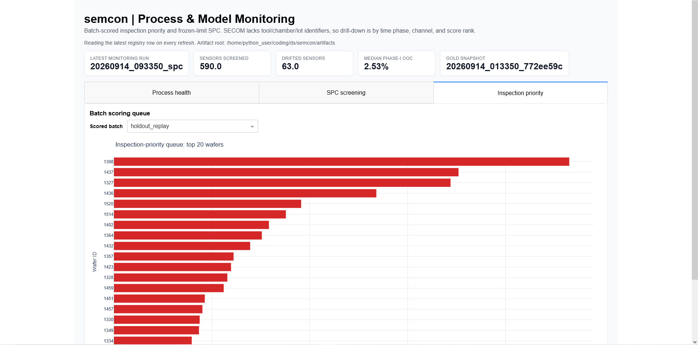
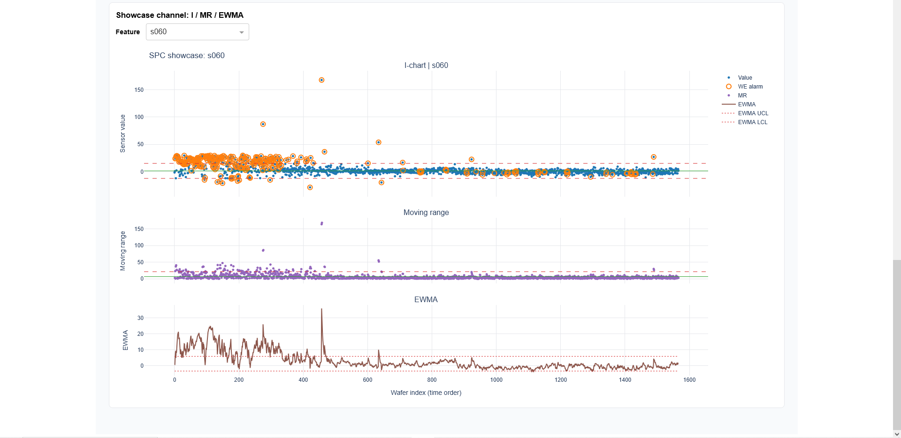
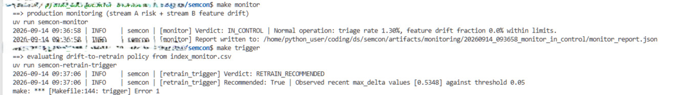

# Semcon — Semiconductor Yield-Risk Decision Support

[](https://github.com/CJRockball/semcon/actions/workflows/ci.yml)
[](https://github.com/CJRockball/semcon/actions/workflows/e2e.yml)
[](https://www.python.org/)
[](https://docs.astral.sh/ruff/)
[](LICENSE)
[](https://github.com/CJRockball/semcon/commits/main)

A reproducible semiconductor manufacturing analytics project built around the UCI SECOM dataset. Semcon turns high-dimensional, missingness-heavy sensor data into calibrated wafer-risk estimates, ranked inspection priorities, model/process-health monitoring, and governed retraining recommendations.

The project is deliberately framed as **decision support**. It demonstrates the analytics, validation, workflow, and software interfaces that support yield and metrology decisions; it does not autonomously change tool recipes, hold/release product, or replace engineering approval.

## Dashboard

The dashboard makes the model run, measurement-priority workflow, and monitoring state accessible to yield/process engineers without requiring them to inspect raw artifacts.


The project also includes calibration/failure analysis, individual-and-moving-range process monitoring, DOE analysis, and monitoring-trigger views:

| Calibration and failure review | I–MR process monitoring |
|---|---|
|  |  |

## What it does

| Operational question | Semcon component | Output |
|---|---|---|
| Is incoming manufacturing data structurally valid? | Ingestion, schema checks, SQLite snapshots | Validated data contract and reproducible snapshot |
| Which wafers merit additional measurement? | Calibrated XGBoost scoring | Per-wafer probability and inspection-priority flag |
| Which lots should be reviewed first? | Scorecard aggregation | Ranked lot and wafer worklist |
| Is the process/model behavior still healthy? | SPC, SARIMAX, and monitoring | `IN_CONTROL`, `INVESTIGATE_CHAMBER`, or `RETRAIN_RECOMMENDED` |
| Is retraining justified? | Retrain policy | Documented retrain recommendation rather than automatic replacement |
| What experiments should be run next? | DOE design, simulation, and analysis | Auditable screening/response-surface workflow |

## System flow

```text
Raw SECOM data
   │
   ▼
Ingest → validate → versioned SQLite snapshot
   │
   ▼
Leakage-controlled training → calibration → evaluation → run registry
   │
   ▼
New/replayed lot features → semcon-score → calibrated wafer-risk scores
   │                                           │
   ▼                                           ▼
semcon-scorecard → ranked inspection worklist  semcon-monitor → health verdict
                                                     │
                                                     ▼
                                           semcon-retrain → policy recommendation
                                                     │
                                                     ▼
                                              Dash operational dashboard
```

The scoring workflow is batch-oriented rather than an always-on prediction API: a scheduled job can invoke `semcon-score` when a lot is ready, write score artifacts, and exit. `semcon-scorecard` then turns those scores into a measurement-priority worklist. Dash is a separate, long-running visualization and audit service.

## Results and validation

The pipeline emphasizes imbalanced-class evaluation and decision quality rather than reporting accuracy alone. The repository records baseline-versus-selected model comparison, holdout evaluation, probability calibration, threshold selection, and explainability artifacts in the run registry and validation documentation.

- Start with [validation.md](validation.md) for split discipline, leakage controls, metrics, calibration, and limitations.
- `artifacts/index.csv` is the model-run ledger.
- `artifacts/runs/<run_id>/` holds immutable run-specific metrics, figures, models, and metadata.
- PR-AUC is prioritized because the defective outcome is rare; ROC-AUC is reported as a secondary discrimination measure.

## Quick start

### Local development

Requirements: Python 3.11+ and [uv](https://docs.astral.sh/uv/).

```bash
git clone https://github.com/CJRockball/semcon.git
cd semcon
uv sync --frozen
```

Run the quality suite:

```bash
uv run pytest
uv run ruff check .
```

The default CI workflow runs linting, the Python test suite, and a small CLI smoke check. A separate end-to-end workflow is available on demand because it downloads the dataset and exercises the full data-dependent path. The smoke-test additions and Docker dashboard deployment were merged on 15 September 2026. [github_mcp_direct]

### Typical local workflow

Use the project CLI help for the current argument contract:

```bash
uv run semcon-ingest --help
uv run semcon-train --help
uv run semcon-score --help
uv run semcon-scorecard --help
uv run semcon-monitor --help
uv run semcon-retrain --help
uv run semcon-dash --help
```

A representative sequence is:

```bash
# 1. Acquire/ingest the dataset and create a validated local snapshot.
uv run semcon-ingest

# 2. Train and register a model run.
uv run semcon-train

# 3. Score an incoming or replayed lot, then produce priorities.
uv run semcon-score
uv run semcon-scorecard

# 4. Evaluate monitoring and retrain policy on accumulated artifacts.
uv run semcon-monitor
uv run semcon-retrain

# 5. Start the local dashboard.
uv run semcon-dash
```

## Dashboard Docker deployment

The root `Dockerfile` packages the pinned `uv.lock` environment, source, SQL, documentation assets, and committed run artifacts. Its default command launches **only the Dash dashboard** on port 8050; it does not start scoring, scorecard generation, or retraining jobs. The repository also includes a `.dockerignore` to keep local environments, Git metadata, and build/test caches out of the image build context. [github_mcp_direct]

Build and run the dashboard from the repository root:

```bash
docker build -t semcon:latest .
docker run --rm -p 8050:8050 --name semcon-dash semcon:latest
```

Then browse to [http://localhost:8050](http://localhost:8050).

For a real batch-oriented deployment, use the same image as a short-lived scheduled workload, with host storage mounted for incoming data and output artifacts. Do **not** combine this with the Dash container unless there is a deliberate orchestration reason to do so:

```bash
# Illustrative only: use `semcon-score --help` for the repository's current flags.
docker run --rm \
  -v "$(pwd)/artifacts:/app/artifacts" \
  semcon:latest \
  uv run semcon-score --help
```

A scheduler such as cron, Airflow, or a Kubernetes CronJob should invoke the scoring workload only after an input lot has been validated and made available atomically. It should then invoke scorecard generation after successful scoring. An idempotency rule—processed-file archive, database status, or immutable lot identifier—is necessary to avoid repeatedly scoring the same lot.

## Monitoring and governance

`semcon-monitor` uses the scored stream and frozen reference boundaries to emit an operational state:

| Verdict | Meaning | Human response |
|---|---|---|
| `IN_CONTROL` | No material output-risk or key-feature drift alarm | Continue normal surveillance |
| `INVESTIGATE_CHAMBER` | Feature/process shift without a corresponding sustained risk shift | Review equipment, recipe, and metrology context |
| `RETRAIN_RECOMMENDED` | Persistent model-output degradation and/or policy conditions | Validate data lineage and holdout performance before approving a new model |

`semcon-retrain` is intentionally downstream of monitoring. It converts accumulated evidence into a governed recommendation; it does not silently overwrite the active model. That separation makes decisions auditable and prevents a transient signal from directly changing production analytics.



## Repository map

```text
src/semcon/
├── db.py, db_ingest.py, extract.py, schema.py, snapshots.py, validate.py
│   └── data acquisition, validation, SQLite snapshots, and data contracts
├── train_xgb.py, selection.py, calibrate.py, evaluation.py, explain.py
│   └── training, selection, calibration, validation, and explainability
├── simulate_lots.py, score.py, scorecard.py
│   └── replayed/incoming batch handling, scoring, and inspection prioritization
├── spc.py, sarimax.py, monitor.py, retrain_trigger.py
│   └── process/model surveillance and retrain policy
├── doe_design.py, doe_run.py, doe_analyze.py
│   └── experimental design, response simulation, and analysis
└── dash_app.py, dash_data.py, dash_figs.py
    └── Dash/Plotly operational visualization

tests/                  pytest suite
docs/                   design and analysis documentation
assets/                 README/dashboard visual assets
artifacts/              committed run registry and demo outputs
.github/workflows/      CI and manually triggered end-to-end workflows
```

## Data and limitations

SECOM is a public benchmark dataset, not a complete fab data model. It lacks true lot genealogy, chamber/tool identifiers, recipes, maintenance history, wafer maps, causal interventions, and real metrology/MES integrations. Accordingly:

- Lot replay and injected drift scenarios demonstrate streaming interfaces and monitoring behavior; they are not claims of a live factory deployment.
- DOE modules provide an explicit experimental-analysis workflow, but synthetic response components are labeled as such and must not be interpreted as observed fab experiments.
- Risk scores are inspection-prioritization inputs, not autonomous disposition, recipe-control, or safety decisions.
- Any production implementation would require validated data lineage, access control, model approval/versioning, integration testing against MES/FDC/metrology systems, and engineering sign-off.

## Further documentation

- [Validation and modeling protocol](validation.md)
- [DOE workflow](docs/doe.md)
- [Data setup and acquisition](data/README.md)
- [GitHub Actions CI workflow](.github/workflows/ci.yml)
- [Manually triggered end-to-end workflow](.github/workflows/e2e.yml)

## License

See [LICENSE](LICENSE).