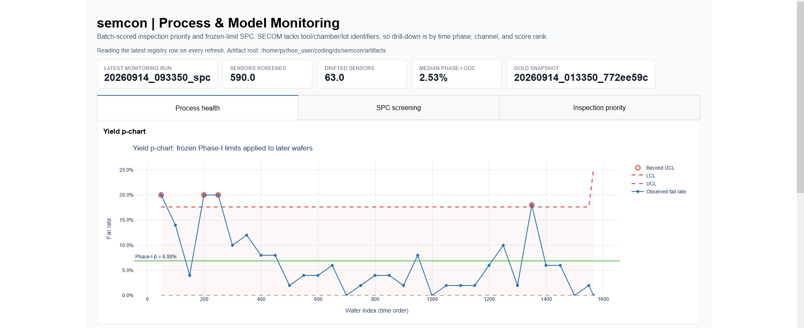

# Semiconductor Yield-Risk Decision Support

A reproducible, time-aware machine-learning and process-analytics workflow built on the UCI SECOM dataset. The project converts high-dimensional, sparse manufacturing measurements into calibrated yield-risk rankings, batch scorecards, statistical monitoring, surrogate DOE evidence, and governed retraining recommendations.

> **Scope:** This is a portfolio implementation using historical SECOM data. It is not connected to a fab MES, FDC, APC, or quality-disposition system. It does not autonomously hold lots, change recipes, diagnose a physical root cause, or deploy a replacement model.



*The Dash interface presents batch risk, inspection-priority evidence, and registered operational artifacts. It is a decision-support layer, not an autonomous manufacturing-control system.*

## What it does

```text
Raw SECOM files
  → SQLite ingestion and validated extraction
  → time-aware preprocessing and feature engineering
  → XGBoost training, calibration, evaluation, and explanation
  → batch scoring and inspection-priority scorecards
  → SPC, forecasting, and model-health monitoring
  → Dash decision-support interface
  → governed retraining recommendation
```

The system is designed around an operational question: given constrained inspection and engineering capacity, which observations or replayed lots deserve attention, and is the available evidence consistent with routine variation, a process/data investigation, or a model-review event?

## Highlights

| Capability | Implementation | Operational value |
|---|---|---|
| Governed data layer | SQLite ingestion, SQL extraction, column registry, snapshots | Separates raw, derived, and model-facing data; preserves lineage |
| Time-aware validation | Development period plus protected chronological holdout | Tests on later observations rather than relying on an unrestricted random split |
| Calibrated risk model | XGBoost, registered feature contract, Platt calibration | Supports probability-based inspection triage rather than raw score ranking alone |
| Batch scoring | Contract validation, score outputs, scorecards, replay scenarios | Converts a model run into a repeatable inspection-priority workflow |
| Process surveillance | SPC, SARIMAX, feature drift, output-health checks | Separates process/data investigation from routine scoring |
| Surrogate DOE | Raw-sensor factors, observed-support levels, OOD diagnostics | Produces bounded engineering hypotheses without claiming causal process effects |
| Model governance | Monitoring verdicts, retraining policy, artifact registry | Makes retraining a reviewable decision rather than an automatic overwrite |
| Decision interface | Dash and Plotly artifact-driven views | Presents risk, monitoring, and provenance for human review |

## Repository layout

```text
.
├── src/semcon/       # Pipeline, models, scoring, monitoring, dashboard, DOE
├── tests/            # Unit and integration-style contract tests
├── docs/             # Technical documentation by lifecycle stage
├── assets/           # Curated documentation screenshots
├── notebooks/        # Exploratory analysis notebooks
├── config/           # Versioned runtime configuration
├── data/             # Local source, SQLite, snapshots; raw data is not tracked
├── artifacts/        # Registered derived runs and decision artifacts
├── validation.md     # Controlled validation record and append-only decision ledger
└── Makefile          # Reproducible pipeline and hygiene commands
```

The Python package separates responsibilities rather than hiding the workflow in one notebook. Ingestion, extraction, feature engineering, training, calibration, scoring, SPC, forecasting, DOE, monitoring, retraining policy, Dash presentation, and artifact tracking are explicit modules under `src/semcon/`.

## Quick start

### 1. Install

This repository uses [uv](https://docs.astral.sh/uv/) for dependency and environment management.

```bash
git clone https://github.com/CJRockball/semcon.git
cd semcon
uv sync
```

### 2. Obtain data

Download the SECOM source data from the [UCI Machine Learning Repository](https://archive.ics.uci.edu/dataset/179/secom) and place the required files in the local location expected by the ingestion command. Raw source data and the generated SQLite database are deliberately excluded from Git.

See [`data/README.md`](data/README.md) for the data contract, source files, database layout, split policy, lineage, and regeneration details.

### 3. Verify the repository

```bash
make test
make hygiene
```

`make test` runs the repository test suite. `make hygiene` enforces repository policy: generated databases are not tracked, and direct data reads remain contained to the intended data-layer boundary.

### 4. Rebuild the core pipeline

```bash
make clean
make
```

`make clean` removes derived databases, snapshots, artifacts, logs, replay data, and caches while preserving raw source data and the local environment. `make` rebuilds the core path: ingestion, extraction, exploration, feature engineering, baseline and selected-feature training, calibration, SPC, and SARIMAX.

### 5. Exercise batch scoring

```bash
make demo
```

The demonstration path creates deterministic incoming-lot scenarios, scores the batches, runs a reconciled chronological-holdout replay, and creates scorecards. These are integration-test fixtures and portfolio evidence—not a live manufacturing data feed.

## Documentation

The technical documentation follows the data-to-decision lifecycle. Read it in sequence for the complete architecture, or jump directly to the area relevant to your review.

| Guide | Focus |
|---|---|
| [Data and preprocessing](docs/01_data_and_preprocessing.md) | Dataset structure, time boundary, missingness clusters, feature policy, and leakage controls |
| [Modelling and results](docs/02_modelling_and_results.md) | Decision objective, model contract, temporal validation, calibration, and result interpretation |
| [Process monitoring and forecasting](docs/03_process_monitoring_and_forecasting.md) | Phase-I/Phase-II SPC, alert interpretation, and SARIMAX forecasting |
| [Surrogate DOE](docs/04_surrogate_doe.md) | Factor eligibility, observed-support levels, OOD checks, interaction analysis, and causal limits |
| [Dashboard and decision support](docs/05_dashboard_and_decision_support.md) | Dash interface, scorecards, operational questions, and traceability |
| [Batch scoring and retraining governance](docs/06_mlops_batch_scoring_and_governance.md) | Batch contract, scenario replay, monitoring states, artifact lineage, retraining policy, tests, and CI |
| [Data contract](data/README.md) | Source layout, database schema, registry rules, snapshots, and local regeneration |
| [Validation record](validation.md) | Canonical model evidence, validation decision, residual risks, and append-only ledger |

## Operational workflow

Prediction, monitoring, and retraining are deliberately separated because they answer different questions.

```text
Incoming or replayed batch
  → schema and feature-contract validation
  → calibrated risk scoring
  → scorecard and inspection-priority ranking
  → feature-drift and output-health monitoring
  → retraining-policy evaluation

IN_CONTROL
  → continue normal scoring and surveillance

INVESTIGATE_CHAMBER
  → review measurement/process context and data lineage

RETRAIN_RECOMMENDED
  → start governed candidate-model review; do not automatically deploy a replacement
```

The `INVESTIGATE_CHAMBER` label is an operational routing shorthand, not a claim that the system has identified a physical chamber fault. SECOM does not provide chamber, tool, recipe, maintenance, or genealogy metadata required for that attribution.

## Canonical portfolio run

The final clean-rebuild model bundle is documented in [`validation.md`](validation.md):

| Artifact | Canonical identifier |
|---|---|
| Selected model | `20260914_093559_xgb_sel` |
| Bound calibrator | `20260914_093608_cal_platt` |
| Status | Accepted for reproducible portfolio demonstration |

The validation record is intentionally stricter than a README summary. It states intended use, data boundaries, validation protocol, operational evidence, residual risks, and the required review before any future candidate model can be promoted.

## Evidence and artifacts

Generated runs are registered under `artifacts/`. The repository keeps a distinction between machine-generated evidence and curated presentation assets:

| Location | Purpose |
|---|---|
| `artifacts/runs/` | Training, calibration, SPC, forecasting, and validation outputs |
| `artifacts/scores/` | Batch scoring and scorecard outputs |
| `artifacts/monitoring/` and `artifacts/index_monitor.csv` | Monitoring reports and append-only surveillance ledger |
| `artifacts/retrain/` | Governed retraining-policy outputs |
| `artifacts/doe/` | Design matrices, surrogate predictions, OOD diagnostics, effects, and interaction artifacts |
| `assets/screenshots/` | Curated stable images used in README and technical documentation |

A displayed score, monitoring decision, or DOE result should be traceable through the registered artifact chain:

```text
Dashboard or decision artifact
  → monitoring report or scorecard
  → scored batch
  → calibration and training run
  → feature contract and configuration
  → extraction and snapshot boundary
```

## Boundaries and limitations

The project is explicit about the difference between a rigorous portfolio workflow and a live manufacturing system.

- **Predictive association is not causal process knowledge.** Model importance and SHAP attribution identify signals relevant to the fitted model; they do not prove a root cause.
- **Surrogate DOE is not a physical DOE.** Factor contrasts use observed support and model predictions. Any recipe change requires controlled physical confirmation within approved operating ranges.
- **Monitoring is not autonomous control.** Alerts route a human investigation and do not release, hold, or alter product or equipment.
- **A retraining recommendation is not deployment.** Data lineage, label maturity, validation, calibration, incumbent comparison, and explicit approval are required before promotion.
- **SECOM is not a complete fab data model.** It lacks chamber/tool identity, recipe, product/layer context, lot genealogy, maintenance events, wafer maps, and physical sensor units.

These constraints determine the design. The objective is to demonstrate a technically defensible analytics lifecycle for wide, sparse, imbalanced, time-dependent manufacturing data while avoiding claims the evidence cannot support.

## License and attribution

Code in this repository is released under the MIT License. The SECOM dataset is external to the repository and remains subject to the terms and attribution requirements of its original source.