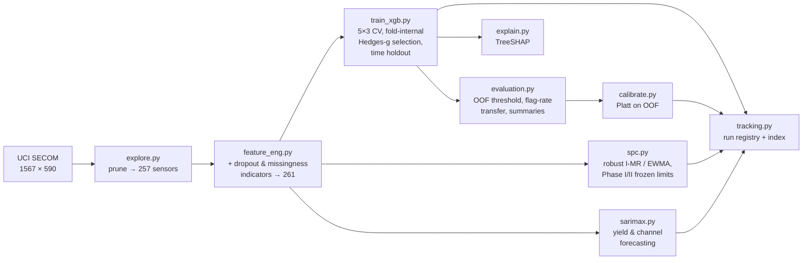

# semcon — Semiconductor Yield: Prediction, SPC Monitoring & Drift Analysis

End-to-end, leakage-free machine-learning pipeline on the public [UCI SECOM dataset](https://archive.ics.uci.edu/dataset/179/secom): pass/fail wafer prediction from 590 anonymized inline sensor signals, with fold-internal feature selection, a time-blocked holdout, SPC monitoring, SARIMAX forecasting, probability calibration, and a timestamped experiment registry.

The point of this repo is not the biggest number — it is honest validation under the conditions a fab actually deploys in: heavy class imbalance (6.6% fails), regime drift over time, and a measurement protocol that itself changes. Every number below is read from a committed run artifact, not from memory.

## Results at a glance

XGBoost (histogram learner, early stopping on PR-AUC, `scale_pos_weight` for the 6.6% fail rate). Evidence: stratified 5×3 repeated CV inside the development pool (first 1,309 wafers); the final model is refit on the full pool and scored once on a time-blocked holdout of 231 wafers (14 fails). The 27-wafer tail is excluded from modeling by design — SPC shows it is a measurement-protocol break, not something a value-based model can anticipate.

| Model | CV PR-AUC | CV ROC-AUC | Holdout PR-AUC | Holdout ROC-AUC | Holdout Brier |
|---|---|---|---|---|---|
| Full feature set (261) | 0.271 ± 0.075 | 0.722 ± 0.077 | 0.092 | 0.605 | 0.060 |
| Fold-internal selection (30–51 feats/fold) | 0.222 ± 0.061 | 0.707 ± 0.046 | 0.148 | 0.698 | 0.061 |

Baselines: no-skill PR-AUC = 0.066 (prevalence); all-pass accuracy = 93.4%. Holdout PR-AUC on 14 positives is noisy — ROC-AUC is the cleaner out-of-time measure.

### The ablation is the result

Feature selection loses in-regime (CV PR-AUC 0.271 → 0.222) and wins where it matters: out-of-time ROC-AUC 0.605 → 0.698, PR-AUC 0.092 → 0.148, and the rank-based triage policy goes from 0/14 to 3/14 holdout fails caught. All 261 features let the model overfit the training regime; fold-internal selection trades in-regime fit for robustness under drift. Same data hash, same splits, same seeds — the two rows in `artifacts/index.csv` are the proof.

### Why not 99%?

Published SECOM results above ~0.70 ROC-AUC are almost always leakage-inflated: feature selection on the full dataset before CV, or random splits that mix time regimes. The most rigorous leakage-free estimate in the literature is ≈ 0.70 ROC-AUC — where this pipeline lands in CV. All selection statistics here are computed inside training folds, and the holdout is blocked by time. Claims of 95–99% on this dataset indicate methodology errors, and this repo is built to show exactly that.

### Operating point

The threshold (0.555) is tuned on out-of-fold scores (MCC), never on the holdout. Transferred as a fixed score it flags 0/14 holdout fails — a threshold on the score scale does not survive regime change. Transferred as a flag rate (flag the top q% by score, q = the OOF flag fraction) it catches 3/14. That contrast is the deployment lesson: under drift, carry over rank-based policies, not scale-based ones.

## Key findings

- Missingness is signal — and it survives honest validation. Sensors drop out in exact groups (dropout cliques: identical is-missing vectors). The engineered dropout indicators (`missclq14`, `missclq23`) rank among the most stable selected features, and SPC confirms the mechanism: clique members go 36% → 94% → 100% missing across the time boundary. The measurement protocol itself changes.
- A stable feature core. Selection keeps 30–51 features per fold; a core of nine is selected in every one of the 15 fits (sensors 21, 28, 59, 103, 129, 348, 431, 510 plus `missclq14`). Full selection-frequency table: `features.json` in each run folder.
- Drift is real, bounded, and not input failure. ROC-AUC 0.707 in-regime → 0.698 out-of-time. Under frozen Phase-I SPC limits, none of the model's stable features drift; drift concentrates in 36 channels the model does not use (max alarm-rate delta 0.288, sensor 467).
- The monitoring layer sees what the value layer cannot. Per-wafer missing rate is flat through the holdout, then jumps to 0.26 in the tail; the yield p-chart catches the holdout fail excursion near wafer 1350; the zero-fail tail sits at the clipped lower control limit — a designed blind spot.
- Gaussian SPC limits would false-alarm ~10× on this data. Median Phase-I alarm rate is 2.68% vs the 0.27% normal-theory nominal — about half the surviving channels are outlier-dominated, so all limits are robust (median/MAD).
- SARIMAX marks the honest boundary of forecasting. On 50-wafer windows the fail-rate series fits ARIMA(0,1,1); a seasonal screen finds no weekly seasonality (AR(1) wins); rolling-origin MASE 0.51 beats persistence in-regime, but holdout MASE 1.46 loses to it — the regime break, again. Interval coverage 1.0; sensor-467 forecast-interval breaches 0. Windowed missingness as an exogenous regressor has the expected negative sign (−4.09) but p = 0.105 — directionally consistent with "missingness halves fail rate", not significant at this sample size.
- Calibration earns its place. Platt scaling fit on OOF: Brier 0.122 → 0.061 (OOF), 0.061 → 0.057 (holdout). The map is monotone, so ranking and the confusion matrix are untouched — calibration changes what the number means, not which wafers get flagged.

## Pipeline



## Repository map

| Path | Contents |
|---|---|
| `src/semcon/explore.py` | Raw → processed: constant / high-missing / correlation pruning (590 → 257) |
| `src/semcon/feature_eng.py` | Engineered indicators: `rowmissingrate`, `missblock5`, `missclq14`, `missclq23` (→ 261) |
| `src/semcon/selection.py` | Fold-internal Hedges-g filter (g_min = 0.25 from config, clamped to 30–100 features) |
| `src/semcon/train_xgb.py` | Repeated stratified CV, OOF scores, final refit, holdout evaluation |
| `src/semcon/evaluation.py` | OOF threshold tuning (MCC), flag-rate transfer policy, summaries, figures |
| `src/semcon/explain.py` | TreeSHAP on the final model (bar, beeswarm, ranked summary) |
| `src/semcon/calibrate.py` | Platt calibration fit on OOF; reliability curves for OOF and holdout |
| `src/semcon/spc.py` | Robust I-MR + EWMA screening over all sensors, showcase charts, p-chart, protocol monitors |
| `src/semcon/sarimax.py` | Windowed fail-rate & drifting-channel forecasting, baselines, exogeneity tests |
| `src/semcon/tracking.py` | Run folders, config/split/feature snapshots, registry indices |
| `src/semcon/config.py` | Pydantic-validated configuration |
| `Makefile` | One-command pipeline: `make` runs data → features → train (base + sel) → calibrate → spc → sarimax |
| `notebooks/` | `eda.ipynb`, `model_results.ipynb`, `spc_results.ipynb`, `sarimax_results.ipynb` — presentation layer only |
| `tests/` | `test_train_xgb.py` (arg parsing, time-ordered tail-drop split, evaluation artifacts), `test_spc.py`, `test_sarimax.py` |
| `artifacts/` | `index.csv` (model leaderboard), `index_monitor.csv` (monitoring runs), `runs/<timestamp>_<name>/` |
| `data/README.md` | Data provenance and fetch instructions (raw data is not committed) |

## How to run

Requires Python 3.11+ and [uv](https://docs.astral.sh/uv/).

```bash
git clone https://github.com/CJRockball/semcon.git
cd semcon
uv sync
# place the SECOM files per data/README.md

make            # full pipeline: data -> features -> train (base + sel) -> calibrate -> spc -> sarimax
make test       # pytest
```

Single stages via make targets: `data`, `features`, `train-base`, `train-sel`, `calibrate`, `spc`, `sarimax`. Or directly via the console scripts declared in `pyproject.toml`:

```bash
uv run semcon-explore
uv run semcon-features
uv run semcon-train_xgb --no-selection --run-name baseline   # ablation arm
uv run semcon-train_xgb --run-name sel_g025                  # selection arm
uv run semcon-calibrate --run-id <run> --method platt
uv run semcon-spc
uv run semcon-sarimax
```

## Experiment registry

Every run writes a timestamped folder under `artifacts/runs/` — `config.json` (git SHA, package versions, data hash), `splits.json` (exact indices), `features.json` (selection frequencies), metrics, figures — and appends one row to the registry: `artifacts/index.csv` for model runs, `artifacts/index_monitor.csv` for SPC/SARIMAX. Derived runs carry the parent name after `__` (e.g. `20260829_103152_cal-platt__sel_g025` is the Platt calibration of the selection run), so lineage is visible from the folder listing alone. Rule: no run counts unless it is in the index — that is what makes the selection ablation a two-row table instead of an opinion.

## Limitations

- 104 fails total: all estimates carry wide uncertainty, and holdout PR-AUC on 14 positives is especially noisy.
- Sensor identities are anonymized and there is no tool/chamber metadata — findings implicate behavior patterns (mean shift, variance shift, tail excursion, protocol signal), not physical root causes.
- With MES/FDC access, the natural next step is per-tool/chamber stratification and a multilevel structure (die within wafer within lot).

## License

MIT — see [LICENSE](LICENSE).
